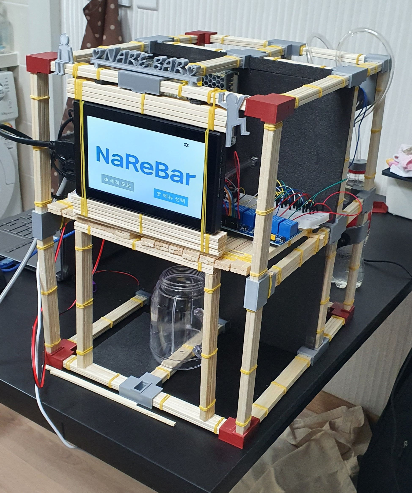

# NAREBAR

- [기획서](https://drive.google.com/file/d/1Pjh1MHnT8vvco5QqzVb-gD_Sag1VSvNQ/view?usp=sharing)
- [Web UI 디자인](https://drive.google.com/file/d/1mG3RfXZyAV0GH9_HAP3oBa4VqBiwnnbO/view?usp=sharing)
- [Local UI 디자인](https://drive.google.com/file/d/1mbv17E_YQ9WuZFX8xKeDhNDy37q7QhTE/view?usp=sharing)

- [릴리즈노트](https://drive.google.com/file/d/1QscnKkrVjy3Sh74RuVOhMGRw924oNGFn/view)

## NaReBar 소개

나레바는 "나만의 레시피 바텐더"의 줄임말로 나만의 칵테일 레시피로 음료를 만들고 공유할 수 있는 모바일 커뮤니티 및 가정용 칵테일 제조기기입니다. 

최근 코로나로 인해 일상생활에 많은 제약이 생기면서 많은 사람들이 침체된 분위기 속에 하루하루를 보내고 있습니다.

이러한 분위기 속에서 저희는 다른 사람들과 함께 즐거워질 수 있는 프로젝트를 하고 싶다고 생각했고, 나레바라는 아이디어를 고안했습니다.

나레바를 통해 원하는 칵테일을 술집에 가지 않아도 집에서 간편하게 제조할 수 있고, 그 레시피를 다른 사람과 공유할 수 있고, 또 다른 사람들의 레시피 그대로 칵테일을 제조할 수 있습니다.

모바일 웹사이트로 접속하면 커뮤니티에서 다른 사람들이 만든 레시피를 보고 마이바에 담을 수 있고, 마이바에서 직접 레시피를 등록하는 것이 가능합니다. 

커뮤니티에서 다른 사람들이 올린 레시피를 보고 좋아요 표시를 하거나 댓글을 달 수도 있습니다.

댓글에도 좋아요를 할 수 있고 대댓글까지 남길 수 있다는 사실!

모바일 웹사이트를 통해 담아둔 레시피를 디바이스에서 받아와 간편하게 칵테일을 제조할 수 있습니다.

우리가 마실 칵테일을 제조할 기계인데 위생을 신경 쓰지 않을 수 없겠죠? 당연히 세척 모드도 준비해두었습니다! 

나레바를 통해서 우울감을 날려 보내고, 우리 모두 밝은 모습으로 이 위기를 헤쳐나갈 수 있으면 좋겠습니다.

## 디바이스 

<h3 align="center">- FRONT -</h3>

<h3 align="center">- SIDE -</h3>

<h3 align="center">- BACK -</h3>

## 프로젝트 산출물

- [기획서](https://drive.google.com/file/d/1Pjh1MHnT8vvco5QqzVb-gD_Sag1VSvNQ/view?usp=sharing)
- [ERD](https://drive.google.com/file/d/1IPDJMx0K04XcpwjvHBSuuyC_UpD18-ax/view?usp=sharing)
- [회로도](https://drive.google.com/file/d/1un7AlISM4Uw9p6J_7rJX27q-vtZmSlwO/view?usp=sharing)
- [3D 모델링](https://drive.google.com/file/d/1uM7y9-6-jKNy0GQ9rMZxRdvo7eJnlBzq/view?usp=sharing)
- [임베디드 명세](https://drive.google.com/file/d/1iOSuVLxVAcIJRJBwMAz5Ti5oJpQmtT5v/view)
- [릴리즈노트](https://drive.google.com/file/d/1QscnKkrVjy3Sh74RuVOhMGRw924oNGFn/view)
- [API](https://drive.google.com/file/d/1GnOVbW3CJNLBv0gmJtFTYRFeQjHIuyOD/view?usp=sharing)
- [예산안](https://drive.google.com/file/d/1KcQU5yn_EYlZiysWpgOt0LvoPYBquoHP/view?usp=sharing)
- [나레바 발표 자료](https://drive.google.com/file/d/1ev1kvrGW4rTEyiguV4xa4yFpT1rZCT8X/view?usp=sharing)

## 기술 및 장비

- 기술 스택

| 기술               | 용도                  | 비고 |
| ------------------ | --------------------- | ---- |
| React              | 프론트엔드 프레임워크 |      |
| DjangoRESTframwork | 백엔드 프레임워크     |      |
| Django             | 백엔드 프레임워크     |      |
| SQLite             | 백엔드 데이터베이스   |      |
| AWS                | 백엔드 배포           |      |
| EC2                | 백엔드 배포           |      |

- 협업 툴

| 툴         | 용도                       | 비고 |
| ---------- | -------------------------- | ---- |
| GitLab     | 형상 관리, 코드 공유, 등.. |      |
| Jira       | 프로젝트 일정 관리         |      |
| mattermost | 메신저                     |      |
| Webex      | 화상 미팅                  |      |
| Hangout    | 화상 미팅                  |      |

- 사용 언어

| 언어       | 용도       | 비고 |
| ---------- | ---------- | ---- |
| Python     | 백엔드     |      |
| Java       | 프론트엔드 |      |
| JavaScript | 프론트엔드 |      |
| C++        | 임베디드   |      |

- 장비

| 장비             | 용도                        | 비고        |
| ---------------- | --------------------------- | ----------- |
| Raspberry pi LCD | 프론트엔드 UI 출력          | 2개 제공    |
| Raspberry pi 4   | 로컬서버, 로컬 UI구동       | 2개 제공    |
| Arduino          | 펌프 및 기타 디바이스 제어  | 2개 제공    |
| diaphragm Pump   | 펌프                        | 자비로 구매 |
| LRS-150-12       | 파워서플라이                | 자비로 구매 |
| 솔레노이드 밸브  | 임베디드 호스 개폐          | 자비로 구매 |
| 릴레이모듈       | 솔레노이드밸드 및 펌프 제어 | 자비로 구매 |
| Ender5           | 3D 프린팅                   | 세진 소유   |

- 3D 모델링

| 프로그램  | 용도                    | 비고 |
| --------- | ----------------------- | ---- |
| Fusion360 | 3D 모델링               |      |
| CURA      | 3D 프린터 출력 슬라이서 |      |

- 언어 사용

## TEAM 

### Samsung Software Academy For Youth, 3기 공통 프로젝트 D209 

- `홍세진` - hongsj36@gmail.com (팀장)
- `유건우` - gunwoo931214@gmail.com
- `임창묵` - lymchgmk@gmail.com
- `황신실` - ohgyosin@naver.com
- `이윤민` - sunday2027@gmail.com

### GITLAB 주소

- https://lab.ssafy.com/s03-webmobile3-sub3/s03p13d209.git

### 배포 URL

- http://i3d209.p.ssafy.io/