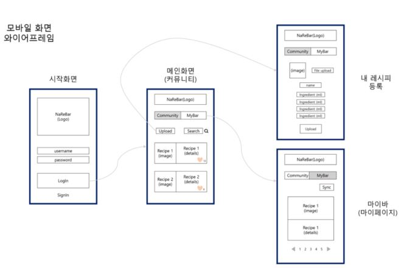
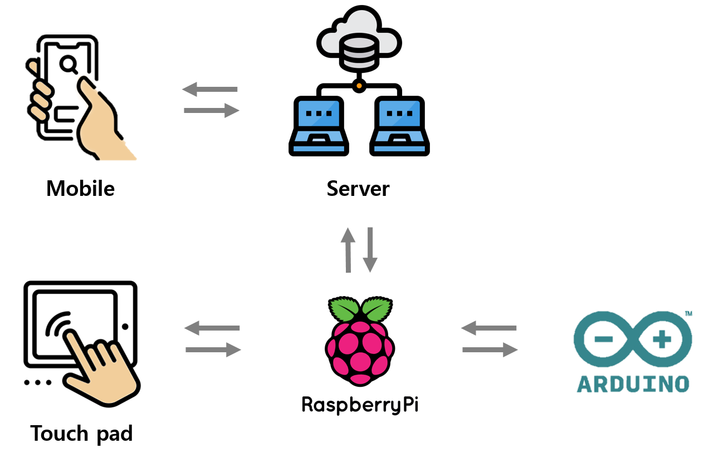

# NAREBAR

- 기획서
- UI디자인

- 디바이스

> - 기획서
> - 아이디어 선정 과정
> - 개발 과정
> - 테스트 과정
> - 팀 활동
>

## 기획서

#### 0. 목차

1. 개요
2. 구상
3. 구현 기술
4. 업무 분배
5. 프로젝트 일정

#### 1. 개요

프로젝트명: 나레바(나만의 레시피 바텐더)

주제: 모바일 웹을 통해 커스텀 레시피를 등록할 수 있는 홈 바텐더 기기 제작

설명:

1. 주제 선정 배경 및 시장 분석

   1. 배경

      ‘코로나바이러스감염증-19’으로 인해 현대인들의 생활 양상에 많은 변화가 일어나고 있다. 2019 년 12월 중국 우한시에서 첫 ‘코로나바이러스감염증-19’ 이 발견된 이후 그 여파는 전 세계로 퍼져나갔다. 대한민국 정부에서는 2020년 2월 23일 감염병 위기 단계를 ‘심각’수준으로 상향했고, WHO(세계보건기구)에서도 2020년 3월 12일 해당 감염병에 대해 최고 경보단계인 펜데믹 (pandemic)을 선언하며 전 세계가 ‘코로나바이러스감염증-19’에 적극 대응하는 모습을 보이고 있다.

      ‘코로나바이러스감염증-19’은 기침, 재채기 등으로 인한 비말에 의해 감염되는 것으로 알려졌으며, 이에 따라 대한민국 정부에서는 사람 많은 곳 방문 자제와 마스크 착용 등의 행동 수칙을 지정했다. 뿐만 아니라 감성주점, 유흥주점, 노래 연습장 등을 고위험시설로 분류하는 등 ‘코로나바이러스감염증-19’의 확산을 막기 위한 많은 노력이 이루어지고 있다.
      
      

   2. 국내 현황

      ‘코로나바이러스감염증-19’으로 인해 감성주점, 유흥주점, 노래 연습장 등이 고위험시설로 분류됨에 따라 집에서 혼자 술을 즐기는 이른바 ’혼술’ 문화가 주류로 자리잡고 있다.

      편의점 CU에 따르면 3월의 주류 매출이 전년 대비 20% 가량 증가했고, 이마트24의 3월 와인 매출은 225.6% 신장하는 등 편의점의 주류 매출이 크게 증가했다. 업계 관계자는 “코로나19로 소비자들의 라이프스타일이 변화하면서 편의점에서는 주류 매출이 가장 두드러지게 나타나고 있다”고 언급했다.

      LG전자는 이러한 흐름에 맞춰 100만원대의 캡슐형 수제 맥주 제조기를 선보이기도 했다.

      [코로나19에 홈술족 시장 ‘봄 바람’… 가정용 주류 소비 늘어(뉴데일리경제)](http://biz.newdaily.co.kr/site/data/html/2020/04/21/2020042100102.html)

      [혼술족 위한 캡슐형 수제맥주제조기 나왔다. (한겨레)](http://www.hani.co.kr/arti/economy/consumer/953122.html)

      

   3. 기대 효과

      칵테일을 즐기는 사람들은 많지만, 레시피를 잘 모르고 실제로 계량하여 제조하는 것이 힘들기 때문에 집에서 즐기기는 쉽지가 않다. 코로나19로 인해 사람들이 붐비는 장소에 가기 힘든 요즘, 집에 머무는 시간이 길어진 사람들은 ‘코로나 블루’라는 우울감을 느끼기도 한다.

      그래서 자동으로 칵테일을 만들어주고, 자신만의 레시피를 만들어 공유할 수 있는 홈 바텐더와 모바일 웹 서비스 “나만의 레시피 바텐더(이하 나레바)”를 제안한다.

      현재 존재하는 시제품 칵테일 머신은 저장된 레시피로 조합하여 칵테일을 제조한다. “나레바”는 사용자가 직접 커스텀하여 칵테일을 만들 수 있고, 자신만의 레시피를 커뮤니티에 올려 다른 사람들과 공유할 수도 있다. 이를 통해 다양한 칵테일을 맛볼 수 있고, 자신의 개성을 표출할 수 있다.

      

2. 프로젝트 개발 방향
      1. 이용 대상

         20~30대 대학생 및 직장인

         

      2. 목표

         1. 여러 술을 섞어서 제공하는 하드웨어 제작
         2. 사용자의 레시피를 입력 받는 모바일 웹 UI 제작
         3. 레시피를 받아오고 공유할 수 있는 커뮤니티 서버 제작

#### 2. 구상

1. 기능 명세

   1. 로컬 UI

      1. React로 칵테일 제조 화면 구현
         1. 대기화면
         2. 레시피 선택 화면
         3. 제조 화면
         4. 완료 화면

   2. 모바일 웹 UI

      1. React로 나레바 사이트 구현
         1. 메인화면
         2. 로그인 화면
         3. 커뮤니티 화면
            1. 나만의 레시피 등록 화면
         4. 마이페이지 화면
            1. 동기화 기능

   3. 서버

      1. 웹서버
         1. 커뮤니티 기능 구현
      2. 로컬 서버
         1. 아두이노 제어
         2. 라즈베리파이로 커뮤니티 레시피 데이터 전송

   4. 임베디드

      1. 수신한 데이터에 맞춰 펌프 제어
         1. 라즈베리파이와의 시리얼 통신
         2. 펌프 제어 회로 구상
         3. 펌프 제어 알고리즘 구현
      2. 제작 완료 정보 전송
         1. 라즈베리파이와의 시리얼 통신

2) 와이어프레임

#### 3. 구현

1. 기술 상세 명세

   1. 목표 기능

      1. API

         1. 웹서버 - 모바일 웹 UI

            | 요청 URL                                                     | 데이터 형식 | 비고               |
            | ------------------------------------------------------------ | ----------- | ------------------ |
            | http://i3d209.p.ssafy.io/                                    | Json        |                    |
            | http://i3d209.p.ssafy.io/admin/                              | Json        |                    |
            | http://i3d209.p.ssafy.io/api/token/                          | Json        |                    |
            | http://i3d209.p.ssafy.io/api/token/refresh/                  | Json        |                    |
            | http://i3d209.p.ssafy.io/community/                          | Json        | Django Restful API |
            | http://i3d209.p.ssafy.io/community/<int: pk>/                | Json        |                    |
            | http://i3d209.p.ssafy.io/community/comment/                  | Json        |                    |
            | http://i3d209.p.ssafy.io/community/comment/<int: pk>         | Json        |                    |
            | http://i3d209.p.ssafy.io/community/article_like/<int: article_pk>/ | Json        |                    |
            | http://i3d209.p.ssafy.io/community/article_save<int: article_pk>/ | Json        |                    |
            | http://i3d209.p.ssafy.io/community/comment/like/<int: comment_pk> | Json        |                    |
            | http://i3d209.p.ssafy.io/accounts/                           | Json        |                    |
            | http://i3d209.p.ssafy.io/accounts/validate/                  | Json        |                    |
            | http://i3d209.p.ssafy.io/accounts/login/                     | Json        |                    |
            | http://i3d209.p.ssafy.io/accounts/verify/                    | Json        |                    |
            | http://i3d209.p.ssafy.io/accounts/refresh/                   | Json        |                    |
            | http://i3d209.p.ssafy.io/accounts/user/                      | Json        |                    |
            | http://i3d209.p.ssafy.io/accounts/user/current/              | Json        |                    |
            | http://i3d209.p.ssafy.io/recipe/                             | Json        | Django Restful API |
            | http://i3d209.p.ssafy.io/recipe/list/                        | Json        | ModelViewSet       |

            

         2. 로컬서버 - 로컬 UI 

            | 요청 URL                                                     | 데이터 형식 | 비고               |
            | ------------------------------------------------------------ | ----------- | ------------------ |
            | https://localhost:8000/admin/                                | Json        |                    |
            | https://localhost:8000/bartender/                            | Json        | Django Restful API |
            | https://localhost:8000/bartender/recipe                      | Json        | ModelViewSet       |
            | https://localhost:8000/bartender/bottle                      | Json        | ModelViewSet       |
            | https://localhost:8000/bartender/recipe/make_cocktail/<int: pk>/ | Json        |                    |
            | https://localhost:8000/bartender/recipe/done                 | Json        |                    |

            

         3. 로컬서버 - 아두이노 

            - 로컬 서버 송신 데이터

            | 요청 내용   | 요청 형식                                          | 데이터 형식 |    비고    |
            | ----------- | -------------------------------------------------- | ----------- | :--------: |
            | 칵테일 제조 | $,MAKE,액상번호,용량 (ml),액상번호,용량 (ml),...,& | 문자열      | 시리얼통신 |
            | 세척        | $,WASH,&                                           | 문자열      | 시리얼통신 |

            - 로컬서버 수신 데이터 

            | 요청 내용        | 요청 형식     | 데이터 형식 |    비고    |
            | ---------------- | ------------- | ----------- | :--------: |
            | 제조 완료        | $,DONE,MAKE,& | 문자열      | 시리얼통신 |
            | 세척 완료        | $,DONE,WASH,& | 문자열      | 시리얼통신 |
            | (선택) 에러 발생 | $,ERROR,&     | 문자열      | 시리얼통신 |

      2. 개발 언어 및 활용 장비

         | 항목             | 적용대상                     | 비고        |
         | ---------------- | ---------------------------- | ----------- |
         | React            | 프론트엔드                   |             |
         | Raspberry pi LCD | 프론트엔드                   | 2개 제공    |
         | Django           | 백엔드                       |             |
         | SQLite           | 백엔드                       |             |
         | AWS              | 백엔드                       |             |
         | EC2              | 백엔드                       |             |
         | Raspberry pi 4   | 프론트엔드, 백엔드, 임베디드 | 2개 제공    |
         | Arduino          | 임베디드                     | 2개 제공    |
         | diaphragm Pump   | 임베디드                     | 자비로 구매 |
         | LRS-150-12       | 임베디드                     | 자비로 구매 |
         | 솔레노이드 밸브  | 임베디드                     | 자비로 구매 |

      3. 예산

         | 상품                                | 모델명                     | 구매링크                                                     | 단가                                     | 개수(ea) | 합계                   | 구매 여부  |
         | ----------------------------------- | -------------------------- | ------------------------------------------------------------ | :--------------------------------------- | -------- | ---------------------- | ---------- |
         | 다이아프램 펌프                     | Micro diaphragm Pump (60W) | [다이아프램 펌프](http://itempage3.auction.co.kr/DetailView.aspx?ItemNo=B505533012&frm3=V2) | 19,200원   ( + 배송비: 2,500원)          | 1        | 21,700                 | 완료       |
         | 릴레이모듈 (8ch)                    | 8ch Serial Module          | [릴레이모듈](http://itempage3.auction.co.kr/DetailView.aspx?ItemNo=B505595214&frm3=V2) | 4,650원   (다이아프램 펌프와 같이 구매 ) | 1        | 4,650                  | 완료       |
         | 파워서플라이(12V출력)               | LRS-150-12                 | [파워서플라이](https://smartstore.naver.com/jooyontns/products/498834333) | 28,500원   ( + 배송비: 2,500원)          | 1        | 31,000                 | 완료       |
         | 우레탄 호스 12(외경)*8(내경) 1m     | Urethane hose              | [pvc호스](https://smartstore.naver.com/saytool/products/3864976067) | 890원   (원터치피팅 pc와 같이 구매)      | 1        | 890                    | 완료       |
         | 우레탄 호스 8(외경)*5(내경) 1m      | Urethane hose              | [pvc호스](https://smartstore.naver.com/saytool/products/3864976067) | 690원   (원터치피팅 pt와 같이 구매)      | 4        | 2,760                  | 완료       |
         | 원터치피팅 pc: 호스 연결            | PC08-02                    | [원터치피팅 pc](https://smartstore.naver.com/saytool/products/3864976067) | 630원   ( + 배송비:  2,500원)            | N+1      | 5,650                  | 완료 (5개) |
         | 원터치피팅 pt: 호스 연결 (t자 연결) | PT08-02                    | [원터치 피팅 pt](https://www.devicemart.co.kr/goods/view?no=12284384) | 1,650원   ( + 배송비: 2,500원)           | N        | 9,100                  | 완료 (4개) |
         | 원터치피팅 pcf: 유량계 연결 (8)     | PCF08-04                   | [원터치피팅 pcf8](https://smartstore.naver.com/saytool/products/3864976067) | 2,200원   (원터치피팅 pt와 같이 구매)    | 1        | 2,200                  | 완료       |
         | 원터치피팅 pcf: 유량계 연결 (12)    | PCF12-04                   | [원터치피팅 pcf12](https://smartstore.naver.com/saytool/products/3864976067) | 2,540원   (원터치피팅 pt와 같이 구매)    | 1        | 2,540                  | 완료       |
         | 모터드라이버                        | L298                       | [모터드라이버](https://www.devicemart.co.kr/goods/view?no=1278835) | 2,200원   ( + 배송비: 2,500원)           | 1        | 4,700                  | 완료       |
         | 솔레노이드 밸브                     | 2Way-솔레노이드(8A)        | [솔레노이드 밸브](https://smartstore.naver.com/washcar/products/3884691932) | 5,000원   ( + 배송비: 3,000원 * 2)       | N+1      | 8,000+ 23,000 = 31,000 | 완료 (5개) |
         | 다이오드 (10개)                     | 1N4007                     | [다이오드](https://www.devicemart.co.kr/goods/view?no=3011)  | 270원   (모터드라이버와 같이 구매)       | 1        | 270                    | 완료       |
         | 레귤레이터 (5V) 모듈                | PWR060010                  | [레귤레이터 5V](https://www.devicemart.co.kr/goods/view?no=1384708) | 2,310원   (모터드라이버와 같이 구매)     | 1        | 2,310                  | 완료       |
         | (+추가) 아두이노유량계              | YF-S201C                   | [유량계](https://smartstore.naver.com/makepcb/products/2075862320) | 8,200원   ( + 배송비: 2,500원)           | 1        | 10,700                 | 완료       |
         | (+선택) LED바                       |                            | 예산 부족                                                    |                                          | 1        |                        |            |
         |                                     |                            |                                                              |                                          |          |                        |            |
         |                                     |                            |                                                              |                                          | 합계     | 120,470                |            |

2. 기술 상세 명세

   1. 모바일 웹 UI

      1. 로그인 화면
         - 로그인 및 회원가입을 표시
      2. 커뮤니티 화면
         - 게시글 및 게시글 작성 버튼을 표시
      3. 마이바 화면
         - 내가 담은 게시글과 내가 작성한 게시글 표시
         - 디바이스에 싱크할 수 있는 버튼 표시

   2. 로컬 UI

      1. 시작 화면
         - 레시피 선택 및 세척 버튼
      2. 레시피 선택 화면
         - 좌우로 스와이프하거나 화살표를 눌러 다른 레시피를 확인할 수 있음
         - 랜덤으로 칵테일을 추천받음
      3. 레시피 확인 화면
         - 담은 레시피와 내가 만든 레시피의 상세 정보를 확인 
         - 제조, 취소  버튼
      4. 상태 화면
         - 제조중
         - 제조완료
         - 세척중

   3. 웹서버

      1. 유저 관리 

         1. 회원가입
            - 로그인 페이지에서 회원 가입이 진행되도록 구현
         2. 로그인
            - 로그인 페이지에서 로그인을 구현하고 로그인이 완료되면 커뮤니티 페이지로 이동할 수 있도록 구현

      2. 커뮤니티

         1. 게시글 작성
            - 나만의 레시피를 작성할 수 있도록 구현. 
            - 칵테일 이미지, 레시피를 등록할 수 있도록 구현 
         2. 게시글 조회
            - 레시피 상세 정보를 확인할 수 있도록 구현
            - 댓글을 작성할 수 있고 확인할 수 있도록 구현
         3. 게시글 수정
            - 게시글 수정이 가능하도록 구현
         4. 게시글 삭제
            - 게시글 삭제가 가능하도록 구현
         5. 게시글 좋아요
            - 게시글을 좋아요할 수 있도록 구현
         6. 게시글 담기
            - 게시글을 담아서 마이바에서 확인할 수 있도록 구현

      3. 댓글

         1. 댓글 작성
         2. 댓글 조회
         3. 댓글 수정
         4. 댓글 삭제
         5. 댓글 좋아요
         6. 대댓글 작성

         

   4. 로컬 서버 

      1. 

   5. 임베디드

      1. 회로구성

         1. 부품 선정

            - 모터 (펌프) : 액상을 펌핑하는 역할

            - 모터드라이버 : 모터 구동을 위한 드라이버

            - 다이오드 : 모터 보호회로에 사용

            - 파워서플라이 (12V출력) : 12V전원 공급

            - 레귤레이터 (5V) : 12V전원 -> 5V전원으로 변환

            - pvc호스 : 칵테일 재료 이동 통로

            - 점퍼선 (수-수, 암-수, 암-암) : 브레드보드 회로 결선

            - 모터 기준으로 전력량 계산하여 적절한 소자를 구매할 것

         2. 회로도 구상

            - 전원부

              - 12V전원을 모터에 공급

              - 레귤레이터를 통해 5V로 변환된 전원을 라즈베리파이와 아두이노에 각각 공급

            - 시리얼 통신

              - 라즈베리파이의 txd와 rxd와 아두이노의 rxd, txd를 연결

            - 모터

              - GPIO와 모터드라이버를 통해 모터를 제어할 수 있도록 구성

              - 모터드라이버와 모터 사이에 다이오드를 통한 보호회로 구성

         3. 회로 결선

            브레드 보드 위에 회도로 대로 결선

      2. 아두이노

         - 펌프

           - 모터 구동

             - GPIO포트 및 모터드라이버를 이용해 모터 구동 코드 개발

           - 펌프 정확도 확인

         - 시리얼통신

           - 컴퓨터와의 시리얼 통신 구현 코드 개발

           - 컴퓨터와의 연결을 끊고 라즈베리파이와의 시리얼 통신 구현

      3. 라즈베리파이

         - 파이썬으로 아두이노와의 시리얼 통신 구현

           - 라즈베리 파이 시리얼포트 활성화
         - 파이썬 씨리얼모듈 import하여 시리얼통신 코드 구현
           - 아두이노와의 시리얼 통신 테스트

      4. 하드웨어 제작

         - 펌프를 추가하여 시제품 제작

           - 케이스 제작

           - LCD 부착

2. 구성도

    - 전체 구상

      

    - 펌프 & 밸브

      

 3. 회로도

    

#### 4. 업무 분배

- FrontEnd: 유건우, 이윤민, 임창묵, 홍세진
- BackEnd: 임창묵(web, local), 이윤민(local), 유건우(web), 홍세진
- Embeded: 황신실(circuit, logic), 홍세진(frame)

#### 5. 프로젝트 일정

- Sub_pjt1
  - 리액트 공부 및 초기 아이디어 구상
- Sub_pjt2
  - 구매 및 기초 기술 구현완료 -> 프로젝트 구현을 위한 준비
- Sub_pjt3
  - 최종완성 

## 아이디어 선정 과정

- 1차 아이디어 회의

  

- 2차 아이디어 회의

  

- 3차 아이디어 회의

  

## 개발 과정

## 팀활동

- Ground Rule

  - 10분 이상 자리 비울 경우 팀원들에게 알리기
  - 면접 혹은 일정이 생길 경우 인지하는 즉시 알리기
  - 서로 비난하지 말기
  - 의견을 이야기한 후 한 줄 요약으로 요점 강조하기
  - 막힐 경우 30분까지 고민해보고 안되면 팀에 공유
  - 미팅할 때 마이크 반드시 켜기
  - 사전고지 없이 지각하지 않기
